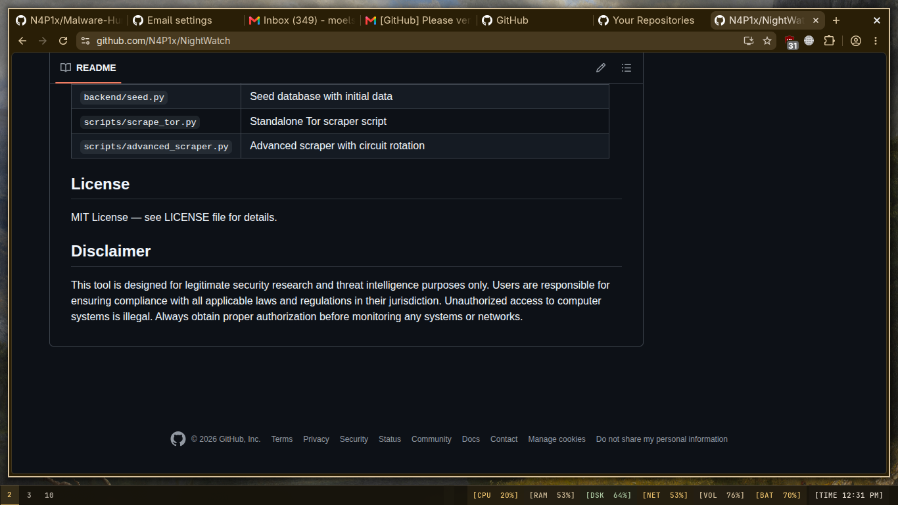

<div align="center">
  
  <br/>
  <h1>mini-ter</h1>
  <p><b>Arch Linux · Hyprland · catbug0x1 · Material You</b></p>
  <p>
    
    
    
    
    
  </p>
</div>

---

## Overview

A cohesive, dynamic-themed Arch Linux desktop environment built on **Hyprland** (Wayland compositor) with a custom **Material Design 3** theming engine called **catbug0x1**. Colors are extracted from the current wallpaper via `matugen` and automatically propagated across **20+ applications** in real-time.

> Theme is currently `dynamic` (wallpaper-generated). Toggle between 10+ themes instantly.

---

## Palette

| Role | Hex | Sample |
|------|-----|--------|
| Background | `#17130b` |  |
| Foreground | `#ebe1d4` |  |
| Primary | `#ebc16c` |  |
| Secondary | `#d9c4a0` |  |
| Tertiary | `#b1cfa8` |  |
| Error | `#ffb4ab` |  |
| Surface | `#241f17` |  |

---

## Components

### Compositor: Hyprland v0.54.3
- 12 modular config files sourced from `hyprland.conf`
- Dynamic theme colors via `theme/colors.conf` (generated by matugen)
- Smooth animations with custom bezier curves
- "Focus Mode" toggles between zero-chrome and aesthetic layouts
- **Alternate compositors also configured:** `sway` and `niri`

### Status Bar: Waybar
- Bottom bar with transparent theme-aware styling
- **Left:** Hyprland workspaces (numbered)
- **Center:** MPRIS media player (artist - title)
- **Right:** CPU, RAM, Disk, Network, Audio, Battery, Clock, System Tray
- Custom CSS with Material You colors imported from `colors.css`

### App Launcher: Rofi
- Custom colored theme with Papirus-Dark icons
- **14 utility scripts:** clipboard manager, emoji picker, keybind viewer, wallpaper picker, theme picker, power menu, wifi manager, music player (rofibeats), web search
- 9 custom layouts for specific use cases

### Notifications: SwayNC + Mako
- **SwayNC:** Control center with MPRIS widget, DND toggle, notification grouping
- **Mako:** Lightweight fallback notification daemon
- Both themed with the MD3 color palette

### Terminals
| Terminal | Config | Font |
|----------|--------|------|
| **Ghostty** (primary) | Full 16-color MD3 palette | JetBrainsMono Nerd Font 11 |
| **Kitty** | Full theme + screensaver variant | JetBrainsMono Nerd Font 11 |
| **Alacritty** | Full theme + screensaver variant | JetBrainsMono Nerd Font 9 |

### Shell: Fish + Starship
- Custom aliases for dev tools, media, packages, system management
- zoxide (smart cd), fzf (fuzzy search), keychain (SSH agent)
- Starship prompt: gold directory + green git branch + red git status

### Lock Screen: hyprlock
- Current wallpaper with blur, time/date overlay
- Fastfetch logo as avatar image
- Fingerprint auth enabled

---

## Theming Pipeline

```
Wallpaper Image
      |
  [matugen]  -- extracts Material You colors
      |
  22 Jinja2 templates
      |
  sync-all script
      |
  +-- Hyprland colors
  +-- Waybar colors + CSS
  +-- Rofi colors + config
  +-- SwayNC colors + CSS
  +-- Mako colors
  +-- GTK3 / GTK4 colors
  +-- Qt5 / Qt6 palette
  +-- Alacritty / Kitty / Ghostty 16-color
  +-- Starship palette
  +-- btop theme
  +-- cava gradient
  +-- Yazi theme
  +-- RMPC theme
  +-- Spicetify (Spotify) colors
  +-- Vesktop (Discord) colors
  +-- Obsidian theme
  +-- Firefox pywalfox integration
  +-- Cursor (Bibata-Modern-Ice)
```

---

## Keybindings

| Category | Bind | Action |
|----------|------|--------|
| **Apps** | `Super + Return` | Terminal (kitty) |
| | `Super + B` | Browser (Brave) |
| | `Super + E` | File manager (nautilus) |
| | `Super + C` | VS Code |
| | `Super + D` | Discord (Vesktop) |
| | `Super + M` | Music (RMPC) |
| | `Super + O` | Obsidian |
| **Web Apps** | `Super + A` | ChatGPT |
| | `Super + Shift + A` | Gemini |
| | `Super + G` | GitHub |
| | `Super + Y` | YouTube |
| | `Super + W` | WhatsApp |
| | `Super + X` | X/Twitter |
| **Window** | `Super + Q` | Kill window |
| | `Super + V` | Toggle float |
| | `Super + F` | Fullscreen |
| | `Super + {1-9}` | Workspace switch |
| | `Super + Shift + {1-9}` | Move to workspace |
| **Theme** | `Ctrl + Alt + Space` | Random wallpaper |
| | `Super + Ctrl + Shift + Space` | Theme picker |
| | `Super + Shift + T` | Ultimate theme menu |
| **Media** | `XF86Audio*` | Volume / Brightness |
| | `Super + F10-12` | Media controls (prev/play/next) |
| **Screenshot** | `Super + P` | Screenshot + editor (satty) |
| | `Super + R` | Screen record (GPU) |
| **Power** | `Super + Shift + L` | Lock |
| | `Super + Escape` | Powermenu |
| **Rofi** | `Alt + comma` | Clipboard |
| | `Alt + period` | Emoji picker |
| | `Alt + space` | Web search |

---

## Included Configurations

<details>
<summary><b>Click to expand full list</b></summary>

| Category | Apps |
|----------|------|
| **Compositors** | Hyprland, sway, niri |
| **UI Shell** | Waybar, Rofi, SwayNC, Mako, Fuzzel, swaylock, swayidle, swayosd |
| **Terminals** | Ghostty, Kitty, Alacritty |
| **Shell** | Fish (config, aliases, functions, completions, env) |
| **Prompt** | Starship |
| **Editors** | Neovim (~53 plugins), VS Code, VSCodium, Kate |
| **Multiplexer** | tmux (with plugins: tpm, sensible, vim-tmux-navigator) |
| **Git** | gh (GitHub CLI), lazygit |
| **Theme Engine** | catbug0x1 (custom TUI), matugen (22 templates) |
| **GTK/Qt** | GTK3, GTK4, Qt5, Qt6, nwg-look |
| **Fonts** | fontconfig (hintslight, subpixel rgb) |
| **System** | systemd user services, WirePlumber (audio priority), uwsm |
| **Display** | kanshi (multi-monitor profiles), SDDM |
| **Monitor** | btop, fastfetch |
| **Audio** | MPD, mpdscribble, cava, RMPC, PulseAudio/WirePlumber |
| **Media** | mpv, Sonic Visualiser, OpenStego |
| **Browser** | Helium (default), Brave, Chromium, Midori |
| **Communication** | Vesktop (Discord), Geary (email), KDE Connect |
| **Notes** | Obsidian, Typora, jrnl |
| **Music** | Spicetify (Spotify) |
| **Dev** | Flutter, Docker, Go, Android SDK |
| **Security** | feroxbuster, ffuf, jadx, sigrok |
| **Files** | Yazi, nnn, PCManFM, libfm |
| **Other** | cliphist, aliases, miimeapps, Okular, OnlyOffice |
</details>

---

## Performance

Targets **Intel i5-6300U / HD Graphics 520**:
- CPU governor management (performance vs powersave)
- Reduced blur (2 passes, size 5)
- Animation timing capped at 1.5s in performance mode
- `apply-optimizations` script sets sysctl kernel parameters
- `systemd/user/performance.service` applies on boot

---

## Requirements

- **OS:** Arch Linux (or any Arch-based distribution)
- **Compositor:** Hyprland (recommended), sway, or niri
- **Display Server:** Wayland
- **Shell:** Fish
- **Fonts:** JetBrainsMono Nerd Font, Inter, CaskaydiaCove Nerd Font, SF Pro Display
- **Icons:** Papirus-Dark, Adwaita
- **Cursor:** Bibata-Modern-Ice

---

## Installation

```bash
# Clone to ~/.config
git clone https://github.com/N4P1x/mini-ter.git ~/.config

# Install dependencies (Hyprland, Waybar, Rofi, etc.)
# Refer to docs/INSTALL.md for the full dependency list

# Run the theme sync
~/.config/hypr/scripts/theme/sync-all
```

> **Note:** This is a personal rice. Some paths may need adjustment for your system. See `docs/` for detailed setup guides.

---

## Credits

- **catbug0x1** - Custom theme engine and desktop integration
- **matugen** - Material You color generation from wallpaper
- All open-source projects powering this setup

---

<div align="center">
  <p>Made with love by <b>N4P1x</b></p>
</div>
